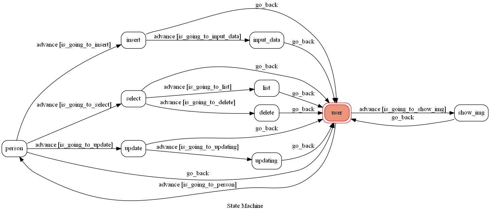
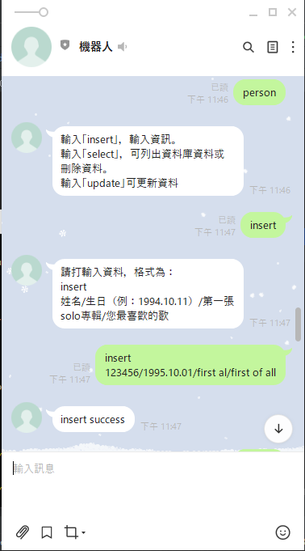
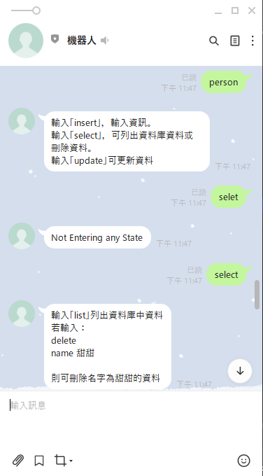
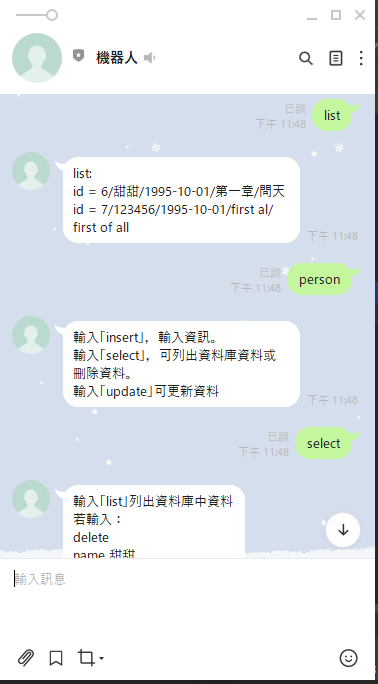
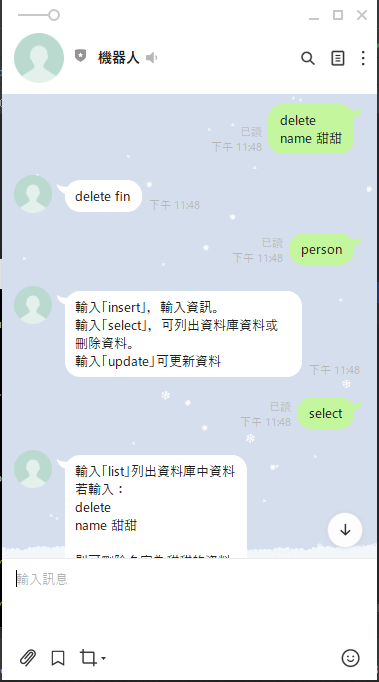
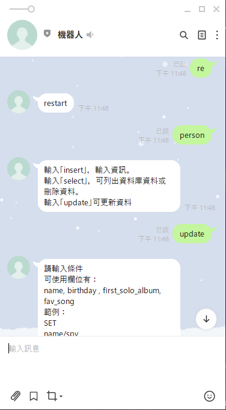
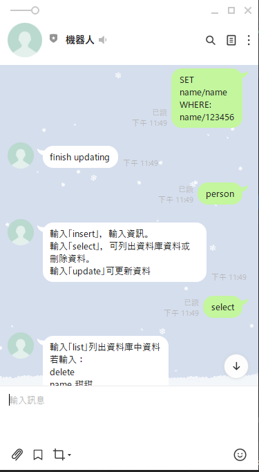
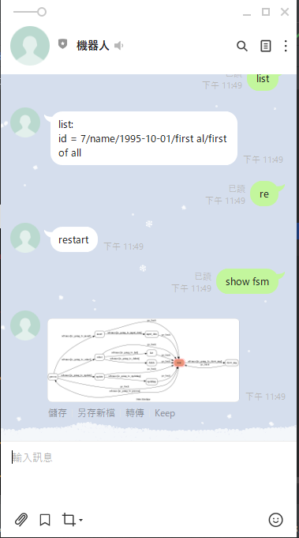

# 資料機器人

因自己喜歡的歌手越來越多，當想要推坑別人時常常一時間想不到特定歌手的基本機料與該歌手的發行曲中我最喜歡的歌名，故建立一個簡易的資料庫來整理我喜愛的歌手列表。

輸入的資料包含歌手名、生日、第一張專輯、我最喜歡的歌。

## 使用方式
###1. heroku：因已部於heroku上，固可直接使用

###2. local 端
1. install `pipenv`、`ngrok`、`heroku`

2. install ```pipenv ```所需套件

3. run `ngrok` to deploy Line Chat Bot locally(`ngrok.exe http 5000`)

4. 從`.env.sample`產生出一個`.env`，並填入以下四個資訊
    - Line
        - LINE_CHANNEL_SECRET
        - LINE_CHANNEL_ACCESS_TOKEN
    - fsm
        - fsm_url=ngrok跑出來的https
        - - 用於生成當下的fsm
    
5. 修改 line 開發者頁面的 Webhook URL

6.將database.py 中的`DATABASE_URL = os.environ['DATABASE_URL']`皆修改成
`DATABASE_URL = os.popen('heroku config:get DATABASE_URL -a f64061070').read()[:-1]`

7.run ```heroku local```
## states

1.user：
    - 輸入"show fsm"獲得此line bot 的fsm。
    - 輸入"person" 進入資料庫。
    - 輸入"re"會回到最開始（user）。
    
2.show fsm:
    - 產出fsm並回到user
    
3.person:
    - 確認是否有資料庫名為person，若無則建立一個。
    
4.insert:
    - 準備插入資料。
    
5.input_data:
    - 輸入欲插入的資料，並將該筆資料插入資料庫中。
    
6.select:
    - 準備列出資料或刪除資料
    
7.list:
    - 列出資料庫中的資料。
    
8.delete:
    - 輸入欲刪除的資料，並刪除。
    
9.update
    - 更新資料。


## Finite State Machine


## 展示







## Reference
[Pipenv](https://medium.com/@chihsuan/pipenv-更簡單-更快速的-python-套件管理工具-135a47e504f4) ❤️ [@chihsuan](https://github.com/chihsuan)

[TOC-Project-2019](https://github.com/winonecheng/TOC-Project-2019) ❤️ [@winonecheng](https://github.com/winonecheng)

Flask Architecture ❤️ [@Sirius207](https://github.com/Sirius207)

[Line line-bot-sdk-python](https://github.com/line/line-bot-sdk-python/tree/master/examples/flask-echo)

[第 17 天：Heroku Postgres：連接 LINE 聊天機器人](https://ithelp.ithome.com.tw/articles/10220773)